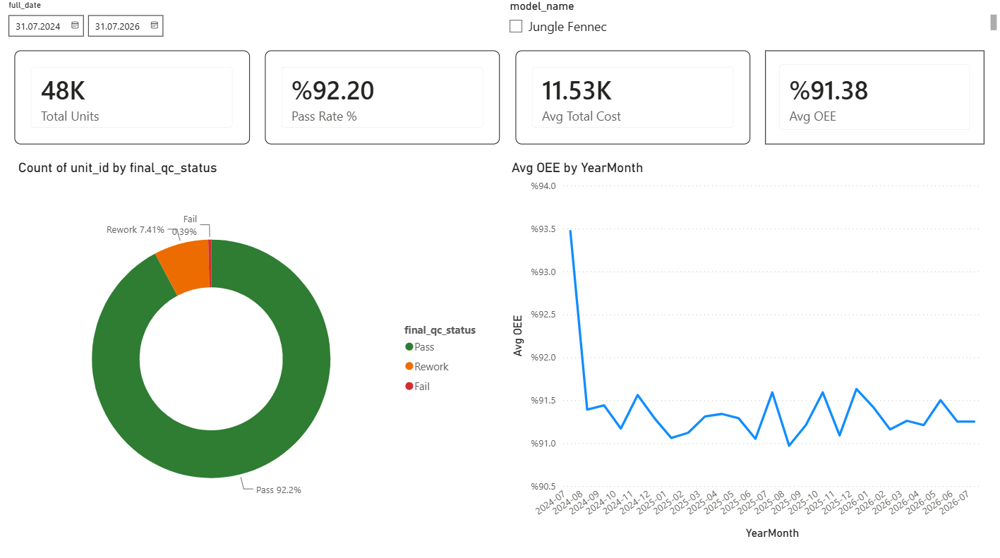
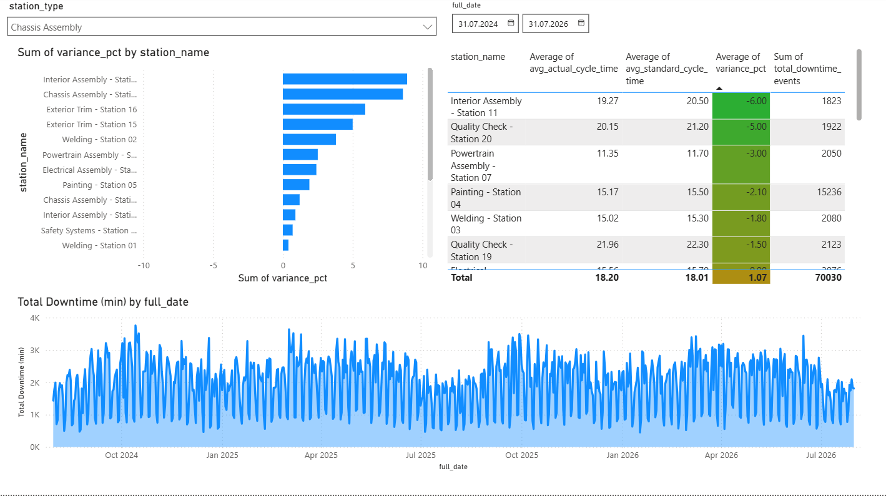
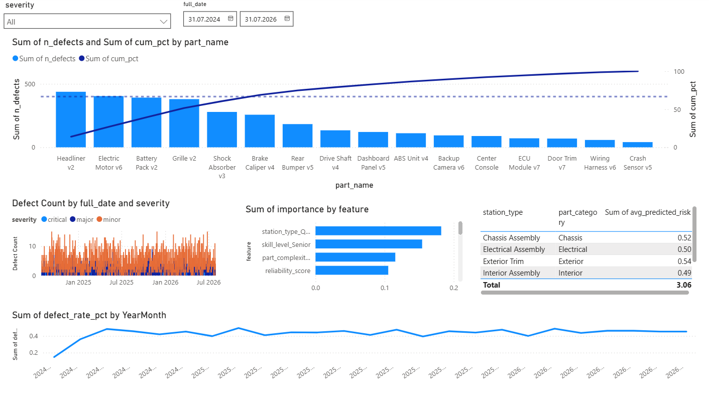
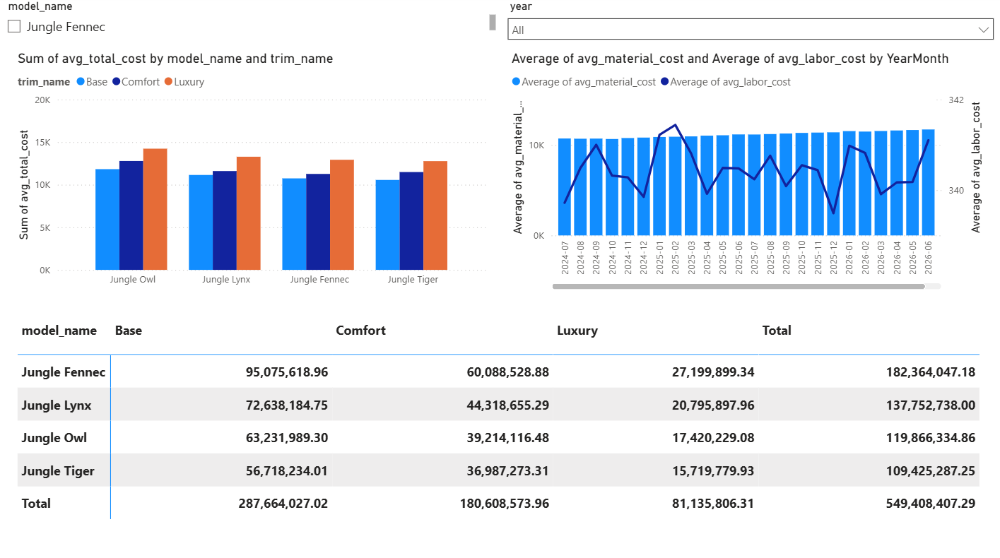
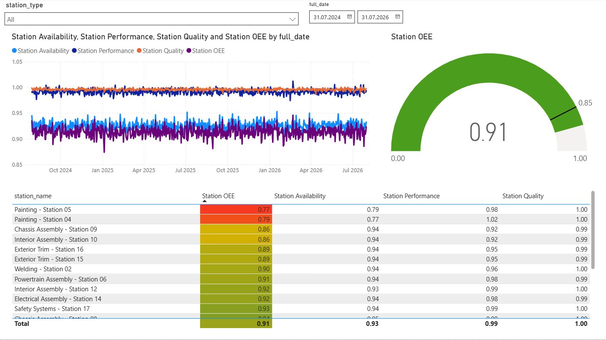

## AutoPulse — Automotive Manufacturing Analytics (Jungle Motors)

End-to-end data engineering and analytics project simulating a car factory's production line, from raw material intake to finished-vehicle quality control. Built with Python (data generation + ML), SQL (SQLite), and Power BI (dashboard).

# Status

✅ Data pipeline (Python + SQL): complete
✅ Power BI dashboard: complete

## What this project does

- Simulates 2 years of production for a fictional automaker (Jungle Motors, 4 models including one EV) across a 20-station assembly line
- Models realistic manufacturing dynamics: takt-time-balanced stations, worker skill effects, sequence-dependent paint changeover, and a multi-factor defect probability model tied to supplier reliability and part complexity
- Loads ~1.8M rows into a relational SQLite database (16 tables, 5 reporting views)
- Runs SQL + pandas analysis: labor bottlenecks, cost breakdown, defect Pareto analysis, OEE, and a defect-risk ML model (Logistic Regression + Random Forest)
- Delivers a 5-page Power BI dashboard covering production, quality, cost, and OEE

## Tech stack

Python (pandas, NumPy, Faker, scikit-learn) · SQLite · SQL · Power BI

## Project structure

- config/              --> single source of truth for all parameters
- data_generation/      --> 8 scripts, run in order (see below)
- sql/                  --> schema (01) + reporting views (02)
- database/             --> SQLite setup + data loading
- analysis/             --> SQL/pandas analysis + ML model
- export/               --> final CSV export for Power BI
- data/powerbi_export/  --> what Power BI actually connects to
- powerbi/              --> production_dashboard.pbix

## How to run it end to end

```bash
pip install -r requirements.txt

# 1) Dimensions + BOM
python data_generation/generate_dimensions.py
python data_generation/generate_bom.py

# 2) Production simulation
python data_generation/generate_production_orders.py
python data_generation/generate_production_units.py
python data_generation/generate_station_operations.py
python data_generation/generate_defects.py
python data_generation/generate_material_usage.py
python data_generation/finalize_production_units.py

# 3) Database
python database/db_setup.py
python database/load_to_db.py

# 4) Analysis
python analysis/labor_time_analysis.py
python analysis/cost_analysis.py
python analysis/defect_analysis.py
python analysis/oee_calculation.py
python analysis/defect_risk_model.py

# 5) Power BI export
python export/export_powerbi_views.py
```

Every script uses a fixed random seed (`config.yaml -> project.random_seed`),
so re-running the full pipeline reproduces identical results.

## Key design decisions

- Synthetic data, deliberately: real automotive production-line data (labor hours, station-level defect rates) is proprietary and never publicly released , a hand-built simulation with realistic, calibrated parameters is the only viable option for a portfolio project.
- Defect rate calibration: tuned against published First Pass Yield benchmarks (~90-96% for a typical automotive line) rather than picked arbitrarily.
- Rolled Throughput Yield: even a low per-station defect rate compounds across 20 stations , the ~92% overall pass rate is the expected mathematical consequence, not an inflated assumption.
- Sequence-dependent paint changeover: color changes at the Painting stations are detected from actual unit-to-unit sequence (not randomly triggered), mirroring how real paint shops incur changeover cost.

## Key findings (from the dashboard)

- 92.2% first-pass yield, in line with published automotive First Pass Yield benchmarks , 7.4% of units need rework, 0.4% require a scrapped component.
- Two distinct bottleneck patterns, only visible by splitting OEE into its three components:
- Painting stations (04/05) have the lowest Availability (~0.77-0.79) , driven by paint-color changeover downtime, not slow work.
- Chassis/Interior Assembly (stations 09/10) have the lowest Performance (~0.92) , driven by cycle-time variance, not stoppages.
- Material cost dominates the cost structure (~97% of total unit cost) , consistent with an OEM that is primarily an assembler, since supplier-purchased parts already embed the supplier's own labor.
- The EV model (Jungle Owl) costs noticeably more to build than the ICE models across every trim, driven by its larger Powertrain parts bill (battery, motor, inverter) replacing the Engine category entirely.
- A small number of parts drive most defects: roughly half of the 16 part-tied defect types (led by the Headliner and the EV's Electric Motor) account for the majority of total rework cost.
- The defect-risk model recovers the true underlying drivers: without being told the generation formula, Random Forest feature importance independently ranked Quality-Check station type, worker skill, part complexity, supplier reliability, and downtime as the top predictors , exactly the factors the simulation was built around.

## Dashboard pages

1. Overview --> KPI cards, pass/rework/fail split, monthly OEE trend 



2. Production & Labor --> station bottleneck ranking, downtime over time



3. Quality & Defects --> Pareto analysis, severity trend, ML feature importance, high-risk station/part combinations



4. Cost Breakdown --> cost by model/trim, material vs. labor trend, cost matrix



5. OEE Panel --> Availability/Performance/Quality trend, OEE gauge, station ranking



## Author's note

I built this project after completing three certificates and a production internship:

- CS50's Introduction to Artificial Intelligence with Python (Harvard University)
- CS50's Introduction to Databases with SQL (Harvard University)
- Prepare and Visualize Data with Power BI (Microsoft)
- Production internship at an automotive parts factory

During my manufacturing internship, I observed the production line and took notes about
production processes. With those observations and my software background, I developed a
synthetic manufacturing simulation project that includes sequence-dependent paint 
changeovers (color-based, not random), takt-time-balanced station cycle times, and more.
